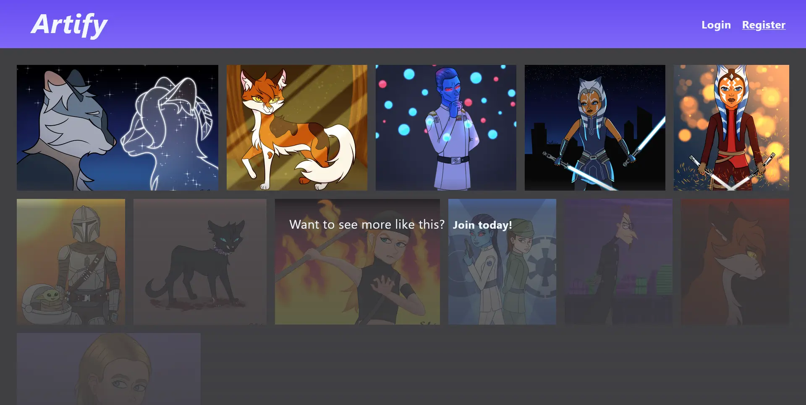
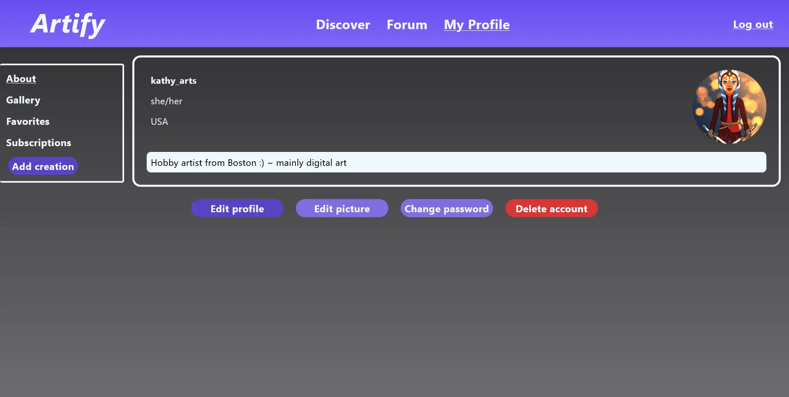
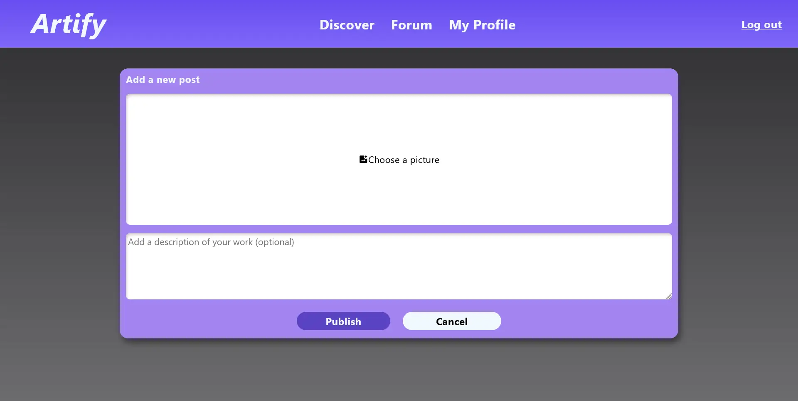
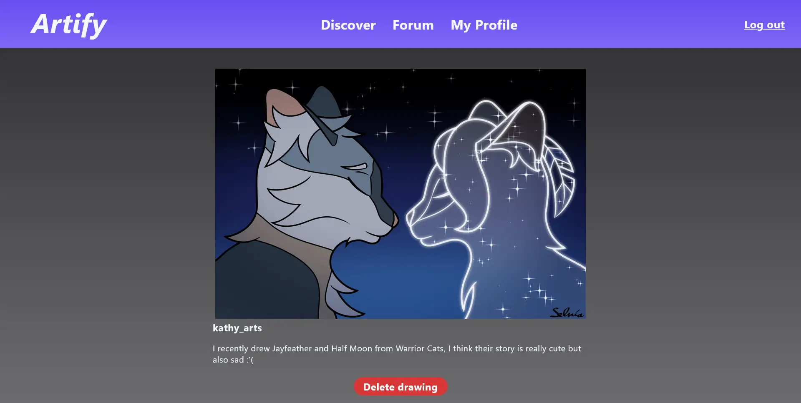
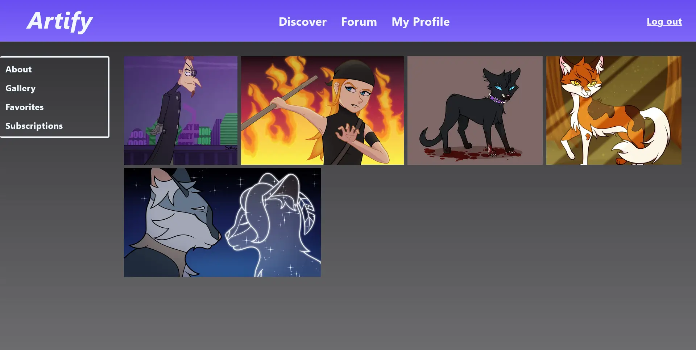

<a id="readme-top"></a>
<!-- PROJECT SHIELDS -->
<!--
*** I'm using markdown "reference style" links for readability.
*** Reference links are enclosed in brackets [ ] instead of parentheses ( ).
*** See the bottom of this document for the declaration of the reference variables
*** https://www.markdownguide.org/basic-syntax/#reference-style-links
-->

<!-- PROJECT LOGO -->
<br />
<div align="center">
<h1 align="center">Artify</h1>

  <p align="center">
    A website to share your art with others.
    <br />
  </p>
</div>

<!-- TABLE OF CONTENTS -->
<details>
  <summary>Table of Contents</summary>
  <ol>
    <li>
      <a href="#about-the-project">About The Project</a>
      <ul>
        <li><a href="#built-with">Built With</a></li>
      </ul>
    </li>
    <li>
      <a href="#getting-started">Getting Started</a>
      <ul>
        <li><a href="#prerequisites">Prerequisites</a></li>
        <li><a href="#installation">Installation</a></li>
      </ul>
    </li>
    <li><a href="#usage">Usage</a></li>
    <li><a href="#roadmap">Roadmap</a></li>
    <li><a href="#acknowledgments">Acknowledgments</a></li>
  </ol>
</details>

<!-- ABOUT THE PROJECT -->

## About The Project

<div align="center">
  
  
  
</div>
<div align="center">
  
  
</div>

Artify is my end project for the 2nd semester of my bachelor programme. The goal was to design and develop a full-stack web application by using node.js. I decided to make a website for sharing art. The UI design, code and also the example drawings shown in the screenshots were made by me.

<p align="right">(<a href="#readme-top">back to top</a>)</p>

### Built With

- [![JavaScript][JavaScript.com]][JavaScript-url]
- [![Node.js][NodeJS.org]][NodeJS-url]
- [![EJS][EJS.co]][EJS-url]
- [![CSS][CSS]][CSS-url]
- [![MySQL][MySQL.com]][MySQL-url]

<p align="right">(<a href="#readme-top">back to top</a>)</p>

<!-- GETTING STARTED -->

## Getting Started

Here you find the instructions on how to set up the project locally.

### Prerequisites

Make sure you have the following installed:

- [node.js](https://nodejs.org/en/download) (LTS is recommended)
- a local MySQL server, for example through [XAMPP](https://www.apachefriends.org/download.html)

### Installation

1. Clone the repo (or download the project as a zip file)
   ```sh
   git clone https://github.com/alexS317/Artify.git
   cd Artify
   ```
2. Install NPM packages
   ```sh
   npm install
   ```
3. Rename the .env.example file to .env which will be where local environment variables are stored. Generate a personal auth token that will be used locally and insert the output as value for the AUTH_TOKEN_SECRET variable.
   ```sh
   node -e "console.log(require('crypto').randomBytes(64).toString('hex'))"
   ```
4. After you've started your local MySQL server, run the script to set up the database and tables. The default database name is "artify", if you want to change it to a custom name, you have to do so in both the setup.js and .env file.
   ```sh
   node db/setup.js
   ```
6. Start the development server
   ```sh
   npm run start
   ```
7. Open your browser at [http://localhost:3000/](http://localhost:3000/)

<p align="right">(<a href="#readme-top">back to top</a>)</p>

<!-- USAGE EXAMPLES -->

## Usage

In the final basic version of this project, which was done over the course of 2 weeks, users can create and customise an account, as well as upload and delete image posts.

<p align="right">(<a href="#readme-top">back to top</a>)</p>

<!-- ROADMAP -->

## Roadmap

- [x] Add user signup and authentication
- [x] Add user profile customisation
- [x] Add picture upload for artworks and profile pictures
- [x] Add styling and responsiveness for mobile devices
- [x] Switch to local database

(optional as I may rather rebuild the project from the ground up)
- [ ] Add image preview on upload pages
- [ ] Delete stored image files accordingly when database entry is removed
- [ ] Make views more reusable overall and remove unnecessary duplicate code

<p align="right">(<a href="#readme-top">back to top</a>)</p>

<!-- ACKNOWLEDGMENTS -->

## Acknowledgments

- Based on [Best README Template](https://github.com/othneildrew/Best-README-Template)

<p align="right">(<a href="#readme-top">back to top</a>)</p>

<!-- MARKDOWN LINKS & IMAGES -->
<!-- https://www.markdownguide.org/basic-syntax/#reference-style-links -->

[product-screenshot-1]: readme-screenshots/artify-1.webp
[product-screenshot-2]: readme-screenshots/artify-2.webp
[product-screenshot-3]: readme-screenshots/artify-3.webp
[product-screenshot-4]: readme-screenshots/artify-4.webp
[product-screenshot-5]: readme-screenshots/artify-5.webp

<!-- Shields.io badges. You can a comprehensive list with many more badges at: https://github.com/inttter/md-badges -->

[JavaScript.com]: https://img.shields.io/badge/JavaScript-F7DF1E?style=for-the-badge&logo=javascript&logoColor=black
[JavaScript-url]: https://www.javascript.com
[NodeJS.org]: https://img.shields.io/badge/Node.js-5FA04E?style=for-the-badge&logo=nodedotjs&logoColor=white
[NodeJS-url]: https://nodejs.org/en
[EJS.co]: https://img.shields.io/badge/EJS-B4CA65?style=for-the-badge&logo=ejs&logoColor=black
[EJS-url]: https://ejs.co
[CSS]: https://img.shields.io/badge/CSS-663399?style=for-the-badge&logo=css&logoColor=white
[CSS-url]: https://developer.mozilla.org/en-US/docs/Web/CSS
[MySQL.com]: https://img.shields.io/badge/MySQL-4479A1?style=for-the-badge&logo=mysql&logoColor=white
[MySQL-url]: https://www.mysql.com/